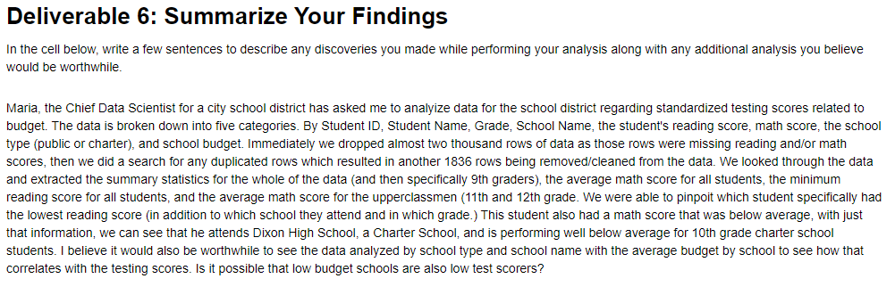

# School_District_Analysis

## Overview
I have been asked by the Chief Data Scientist for a local school district to analyze data related to school budgets.

## Resources

- Data Source: new_full_student_data.csv
- Software: Jupyter Notebook, Pandas, Visual Studio Code 1.74.1

## Summary
I have summarized my findings within the Jupyter Notebook file.

